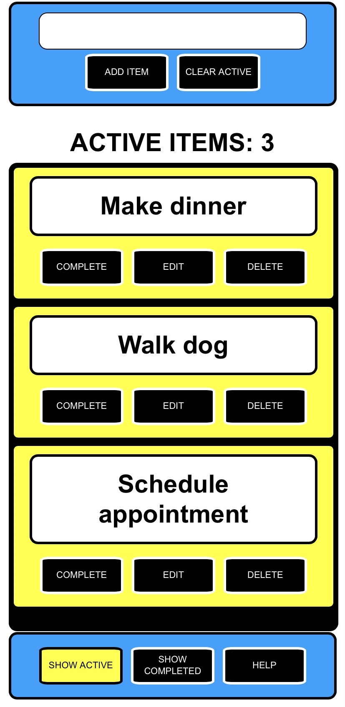
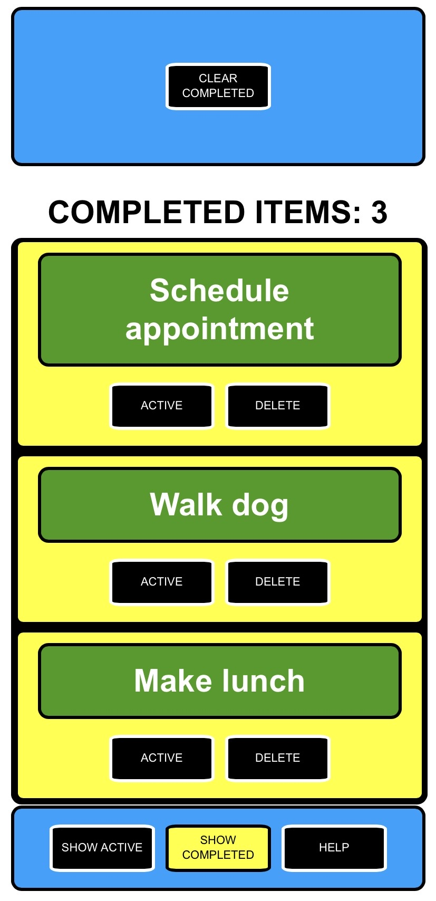
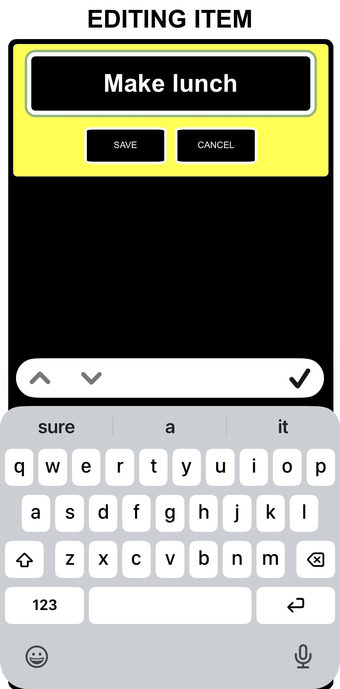

# EasyTodos

A simple, accessible task management app designed to reduce complexity.

Description:
This is an accessible todo list application designed for individuals with visual and cognitive challenges.

# Live Demo & Installation

## Live Demo

Try the application here:

https://jasonhusain.github.io/accessible-todo-app/

# Install on Your Mobile Device

This application is a **Progressive Web App (PWA)**. It can be installed directly from your mobile web browser—**no App Store or Google Play download is required.**

Once installed, the app launches from your Home Screen like a native application and supports offline use after the initial visit.

## Android (Chrome, Edge, Samsung Internet)

1. Open the application using the link above.
2. Tap the browser menu (⋮).
3. Select **Install app**, **Install**, or **Add to Home screen** (the wording varies by browser).
4. Confirm the installation.
5. Launch the app from your Home Screen.

## iPhone / iPad (Safari)

1. Open the application using **Safari**.
2. Tap the **Share** button.
3. Scroll down and select **Add to Home Screen**.
4. Tap **Add**.
5. Launch the app from your Home Screen.

## Desktop Installation (Optional)

Most modern desktop browsers also allow the application to be installed.

### Google Chrome / Microsoft Edge

1. Open the application.
2. Click the **Install** icon in the address bar, or open the browser menu and choose **Install App**.
3. Confirm the installation.

The application will then run in its own window like a native desktop application.

---

# Offline Support

This application uses a **Service Worker** to cache essential application files.

After the application has been opened once while connected to the internet, it can continue functioning offline (subject to browser caching limitations).

---

## Notes

- No App Store or Google Play installation is required.
- An internet connection is only required for the initial download.
- Once installed, the application behaves like a native application.
- The application will automatically receive updates when a new version is deployed.

Features: - Active and completed list views - Buttons to navigate between modes - List item counts for both views - Marking items Complete/Active - Deleting individual items - Inline editing for active items - Buttons to clear al items from lists - App use instructions dialog - Responsive mobile design - PWA support - Offline functionality

Accessibility features: - ARIA labels for elements - ARIA live announcements for events - Keyboard navigation and actions

Technologies used - HTML5 - CSS3 (Flexbox) - JavaScript (ES6)

## Screenshots

<h2>Active View</h2>

  The default active list view where you can add and manage tasks.

<h2>Completed View</h2>

  View and manage completed tasks separately from active tasks.

<h2>Editing Mode</h2>

  Edit existing tasks with visual indicators and keyboard support.

<h2>Help Modal</h2>

  Built-in help with keyboard shortcuts and usage instructions.

